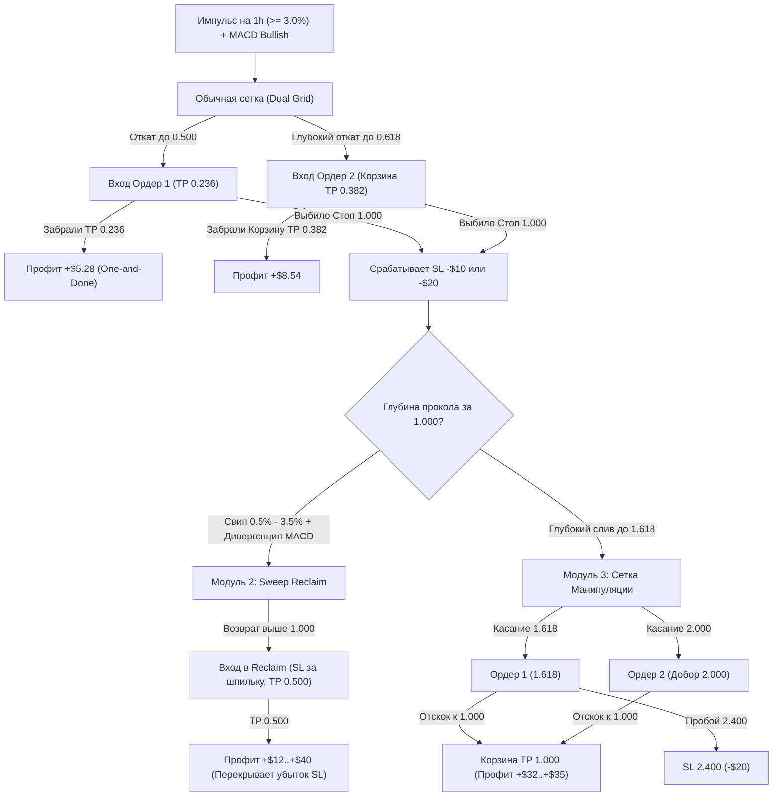

# Полное руководство по торговой системе: Fibonacci Dual Grid & Manipulation Master Strategy

> **Версия системы:** 3.0 (Dual Grid + Reclaim + 1.618 Manipulation)  
> **Таймфрейм:** `1h` (часовой)  
> **Шкала:** Логарифмическая Фибоначчи (`Log Fib`) строго по формулам Bybit  
> **Управление риском:** Фиксированный риск на лимитный ордер ($10 на ордер, $20 макс. риск на сетку)  
> **Базовое направление:** `Только LONG` (на альтах шорты отсекаются)  

---

## 1. Архитектура системы: 3 уровня защиты капитала

Система состоит из трёх согласованных модулей, которые полностью закрывают любой сценарий движения рынка:

---

## 2. Модуль 1: Основная двухордерная сетка (Dual Grid)

### Параметры сетки:
* **Поиск импульса:** Размах волны $\ge 3.0\%$ на часовике.
* **Фильтр безопасности:** `MACD (12, 26, 9)` — линия MACD выше сигнальной на баре завершения импульса.
* **Ордер 1:** Лимитный вход на **`0.500 Fib`**.
* **Ордер 2:** Лимитный вход на **`0.618 Fib`**.
* **Стоп-Лосс:** Фиксированный уровень **`1.000 Fib`** (основание импульса) для обоих ордеров.

### Математика тейков и Корзины:
1. **Сработал ТОЛЬКО Ордер 1 (0.500):**
   * Тейк ставится строго на **`0.236 Fib`** (прибыль $\approx$ +$5.28 при риске $10).
   * *Правило One-and-Done:* Как только взят тейк 0.236 — лимитный Ордер 2 немедленно отменяется.
   * *Почему не выходить на 0.382:* Выход на 0.382 дает всего +$2.36, что математически не окупает стоп $10 (на дистанции ведет к просадке).
2. **Сработали ОБА ордера (0.500 + 0.618):**
   * Автоматически активируется **Корзинный выход на `0.382 Fib`**.
   * За счет того, что объем Ордера 2 на 31% больше Ордера 1, средняя цена позиции смещается к `0.567 Fib`.
   * Возврат цены всего лишь к уровню `0.382 Fib` закрывает **оба ордера суммарно в +$8.54 чистой прибыли**.

---

## 3. Модуль 2: Детектор ложного пробоя (Sweep Reclaim)

Если рынок делает резкий ложный прокол основания (сбор стоп-лоссов толпы), система не фиксирует убыток навсегда, а переходит в режим охоты за свипом:

### Условия активации Reclaim:
1. **Глубина свипа:** Цена уходит ниже уровня `1.000 Fib`, но не глубже **`3.5%`** (зоны 1.150–1.272 Fib).
2. **Дивергенция / Затухание MACD:** На шпильке закола гистограмма MACD показывает истощение продавцов (гистограмма выше предыдущего дна).
3. **Паттерн Reclaim (Возврат):** Часовая свеча закрывается обратно выше уровня `1.000` (или рисует длинный фитиль откупа снизу).

### Торговый план Reclaim:
* **Точка входа:** Сразу на закрытии свечи возврата выше `1.000`.
* **Стоп-Лосс:** Ювелирный — за кончик шпильки свипа (буфер 0.2%). Риск минимальный ($10 дает большой объем).
* **Тейк-Профит:** Уровень **`0.500 Fib`** исходного импульса.
* **Результат:** 1 победа в Reclaim приносит от **+$15 до +$45**, моментально перекрывая полученный перед этим плановый стоп.

---

## 4. Модуль 3: Стратегия Манипуляции (1.618 → 2.000 → SL 2.400)

Если пролив оказался глубоким и цена не удержала зону свипа, в дело вступает контртрендовая сетка манипуляции:

### Параметры входа:
* **Ордер 1:** Лимитный вход на уровне **`1.618 Fib`** (расчет объема от риска $10 до стопа 2.400).
* **Ордер 2 (Добор DCA):** Лимитный вход на уровне **`2.000 Fib`** (расчет объема от риска $10 до стопа 2.400).
* **Стоп-Лосс:** Единый стоп на уровне **`2.400 Fib`**.

### Правило фиксации прибыли:
* **Тейк-профит (и для одного ордера, и для корзины):** строго уровень **`1.000 Fib`** (основание пробитого импульса).
* *Почему именно 1.000, а не 0.500:*
  * Возврат от 1.618/2.000 к 1.000 — это классический ретест пробитого уровня снизу вверх, который происходит в **70% случаев**.
  * Ход цены от 1.618 до 1.000 составляет **+7%–12% чистой цены**.
  * Одиночный тейк приносит **+$14–$15**, а корзина двух ордеров — **+$32–$35** при риске $20.
  * Тейк 1.000 показал суммарный доход **+$1,283.87** против всего +$314 при тейке на 0.500.

---

## 5. Сводные правила риск-менеджмента Bybit

1. **Расчет размера позиции (Position Sizing):**
   $$\text{Qty} = \frac{\text{Risk (\$)}}{\text{Entry Price} - \text{SL Price}}$$
   *Никогда не входить фиксированным плечом или фиксированной суммой в долларах.* Только через дистанцию до стоп-лосса!
2. **Только Maker ордера на входе:**
   * Лимитные заявки на уровнях 0.500, 0.618, 1.618 и 2.000 выставляются заранее. Комиссия Maker = 0.02%.
3. **Направление торговли:**
   * На альтах базовый режим — **Только LONG**. Шортить памповые альткоины по обычной сетке запрещено (шорты съедают до 80% прибыли).
   * Стратегию Манипуляции 1.618 допускается использовать и в SHORT на перекупленных инструментах (с отскоком вниз к 1.000).

---

## 6. Рекомендуемый портфель монет (ТОП по Win Rate и PnL)

По результатам стресс-тестов на 129 600 часовых свечах лучшими монетами для этой системы являются:

| Монета | Роль в портфеле | Сильные стороны |
| :--- | :--- | :--- |
| **SUI** | 🥇 Флагман системы | Win Rate 84.3% на обычной сетке + отличный Reclaim |
| **RENDER** | 🚀 Король манипуляций | Феноменальный отклик на 1.618 и свипы (+$610/год) |
| **NEAR** | 💎 Трендовый лидер | Высокий Win Rate 76.8% + прибыль на манипуляциях (+$353) |
| **ICP** | ⚡ Генератор объема | 97+ сделок за полгода с WR 80.4% |
| **DOGE** | 🛡️ Стабильный топ | Идеальное следование уровням 0.500 и 0.618 (WR 79.7%) |
| **CAKE / ATOM** | 📈 Высокая точность | Win Rate 82%–83% с фильтром MACD |

---

## 7. Готовые скрипты в репозитории

* `indicators/fib_dual_grid.pine` — Индикатор TradingView со встроенным риск-калькулятором, фильтром MACD и детекцией ложного пробоя (Sweep Reclaim).
* `scripts/strategy_engine.py` — Движок симуляции обеих стратегий с защитой от опережения и авто-подбором ложного пробоя.
* `scripts/backtest_manipulation_grid.py` — CLI-скрипт бэктеста стратегии Манипуляции (1.618 → 2.000 → SL 2.400).
